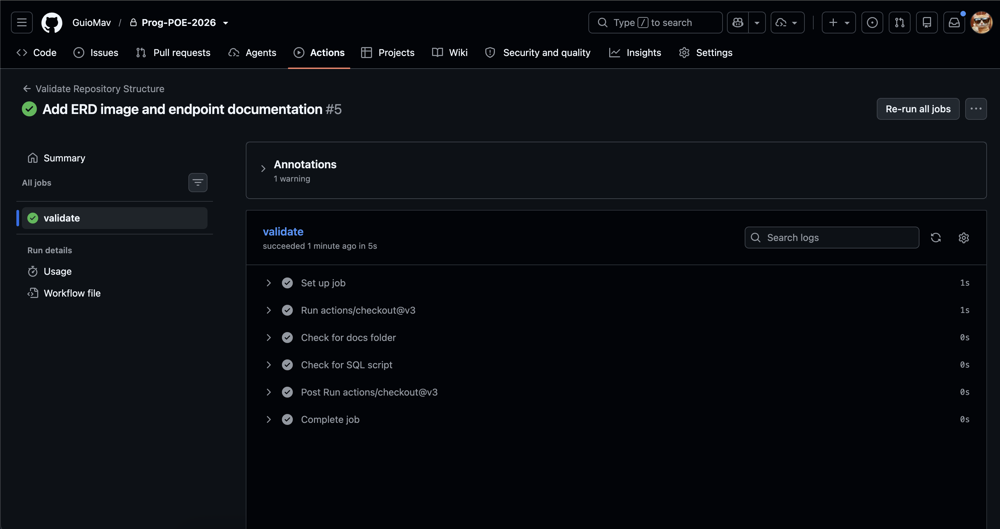

# Prog-POE-2026 / RaceDay Database

## System Description
The RaceDay system is a comprehensive database solution designed for managing running events. It handles the organization of events, race categories, participant enrollments, and tracks race results including finishing times and positions.

## User Roles
* **Organiser (Admin)**: Responsible for creating and managing events, defining race categories (e.g., 5K, 10K, Half Marathon), and overseeing race logistics.
* **Participant (Standard/Premium)**: Runners who enroll in events, participate in various race categories, and can view their personal race results and finishing positions.

## CI/CD Validation
The repository uses GitHub Actions to validate the structure (ensuring the SQL scripts and docs folders exist).

## Entity Relationship Diagram (ERD)
Here is the Entity Relationship Diagram for the RaceDay database:

## Video Walkthrough
[Click here to watch the YouTube Video Walkthrough](https://youtu.be/wno92xTGZuY)
